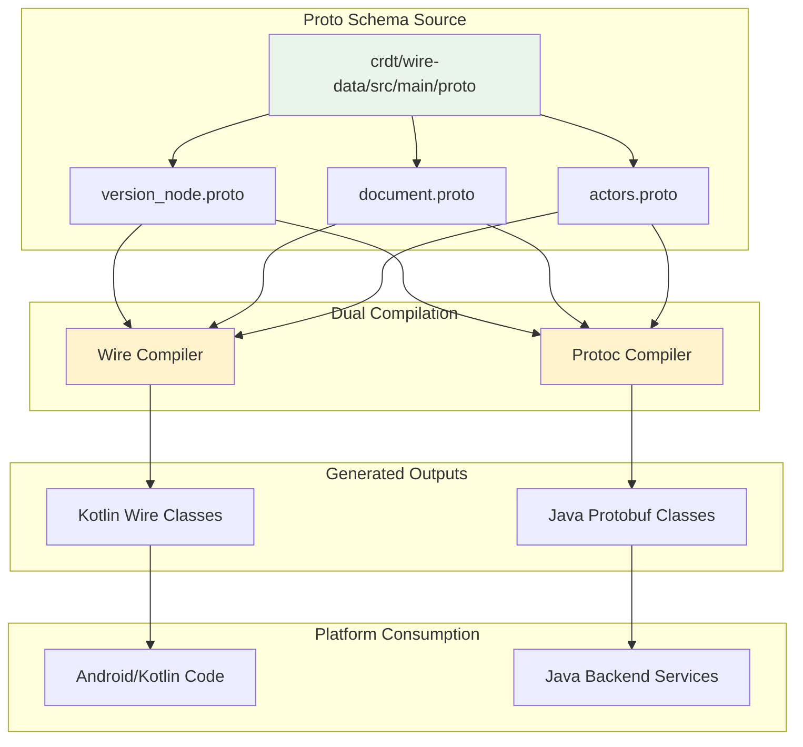
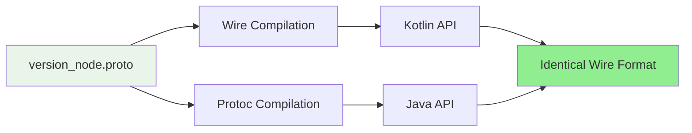

# CRDT Protoc-Data Module

This module provides Java protobuf class generation from shared proto schemas, enabling cross-platform data format compatibility between Wire (Kotlin) and Protoc (Java) without maintaining duplicate schema definitions.

## Historical Context

### Cross-Platform Data Format Solution

**Problem:** The `crdt/wire-data` module defines proto schemas compiled with Wire for Kotlin, but Java backend services and other platforms needed access to the same data structures without depending on Wire.

**Alternatives Considered:**

1. **Duplicate Proto Definitions** (rejected):
   - *Rejected because:* Schema drift inevitable, double maintenance burden, no binary compatibility guarantees, testing complexity

2. **Force Wire Adoption Everywhere** (rejected):
   - *Rejected because:* Wire optimized for Kotlin (less ergonomic in pure Java), backend services standardized on Google protobuf, unnecessary dependency for simple data access

3. **JSON or Alternative Serialization** (rejected):
   - *Rejected because:* Lost type safety and schema validation, JSON serialization overhead for mobile bandwidth, protobuf's backward/forward compatibility critical for distributed systems

4. **Code Generation from Wire Schema** (rejected):
   - *Rejected because:* Wire schema files not standard .proto format, complex build tooling to convert between formats

**Architectural Trade-offs:**
- **Shared Proto Source vs Independent Schemas:** Single proto source compiled twice (Wire and protoc) guarantees schema consistency
- **Build Complexity vs Runtime Flexibility:** Dual compilation in build system avoids runtime adaptation layers
- **Module Dependency Direction:** Made protoc-data depend on data module's proto files rather than generated code to maintain single source of truth

## Architecture Overview

The Protoc-Data module is a build-time compilation layer producing Java classes from shared proto schemas:

---

## Key Concepts

### 1. Compile-Time Duplication Strategy

Rather than runtime conversion between Wire and protoc representations, both are generated at build time:

**Trade-off:** Larger build artifacts and potential for behavioral differences vs runtime conversion overhead and complexity.

**Critical Guarantee:** Despite different generated code, Wire and protoc produce binary-compatible serialized data, which is fundamental to cross-platform CRDT synchronization.

### 2. Wire Format Compatibility

Wire and protoc generate different APIs but produce identical wire format bytes:

**Verification:** Integration tests ensure Wire and protoc serialization produce byte-identical output for all CRDT data structures.

### 3. Schema Evolution Strategy

Both Wire and protoc must handle schema changes identically for cross-platform compatibility:

| Change Type | Wire/Protoc Behavior | Compatibility |
|-------------|---------------------|---------------|
| Add optional field | Default value | ✅ Forward & Backward |
| Remove field | Ignored | ✅ Backward only |
| Rename field (same tag) | Transparent | ✅ Both |
| Change field type | Compile error | ❌ Breaking |

**Best Practice:** Always use optional fields and reserve deleted field numbers to prevent schema conflicts.

### 4. Module Purpose Clarity

**What This Module IS:**
- Java protobuf class generation from shared proto schemas
- Cross-platform data format compatibility layer
- Build-time artifact for Java consumers of CRDT data

**What This Module IS NOT:**
- CRDT resolution logic (see `crdt/protoc` module)
- DocumentStore implementation (see `crdt/core` module)
- Proto schema definitions (defined in `crdt/wire-data` module)

### 5. Generated Java API Patterns

The generated Java classes follow standard protobuf patterns:
- Builder pattern for construction
- Immutable value objects
- Standard serialization/deserialization methods

---

## Integration Patterns

### For Java Backend Services

Backend services deserialize CRDT data received from Android clients using standard protobuf parsing. The module provides Java classes for `DistributedDocument`, `VersionNode`, `VersionSequence`, and `Actors` messages.

**Access Pattern:**
1. Deserialize `DistributedDocument` from bytes
2. Access version information from `version_node` field
3. Deserialize business data from `wire-data` field
4. Use `version_vector` for fast sync decisions

### For CRDT Resolution

**Important:** Don't use protoc-data directly for CRDT operations. Use `crdt/protoc` module which provides resolution logic built on top of these data structures.

### Cross-Platform Compatibility Testing

Integration tests verify Wire and protoc generate compatible bytes by:
1. Creating structures in Wire (Kotlin)
2. Serializing to bytes
3. Deserializing in protoc (Java)
4. Verifying field values match
5. Re-serializing and comparing bytes for identity

---

## Build Configuration

The module's build configuration sources proto files from `crdt/wire-data` rather than duplicating them:

**Key Configuration Points:**
- Uses standard Google protobuf compiler
- Sources proto files from `crdt/wire-data` module
- Generates Java classes only (no Kotlin extensions)
- Produces standard Java protobuf builder patterns

---

## Testing Strategy

Since this module contains no runtime logic, testing focuses on:

1. **Build Verification:** Ensure proto files compile without errors
2. **API Stability:** Generated APIs match expected patterns
3. **Cross-Platform Compatibility:** Wire and protoc produce identical wire formats (tested in integration tests)
4. **Schema Evolution:** Forward and backward compatibility tests

See `crdt/protoc` module for CRDT resolution logic tests.

---

## Limitations and Considerations

### Current Limitations

1. **No Kotlin Extensions:** Generated Java classes lack Kotlin-friendly extensions (use Wire classes for Kotlin)
2. **Builder Verbosity:** Java builder pattern more verbose than Kotlin's Wire DSL
3. **Null Handling:** Java protobuf doesn't distinguish between unset and default values (proto3 limitation)
4. **No Custom Options:** Standard protoc doesn't support Wire's custom field options in generated code

### When NOT to Use This Module

- **Kotlin/Android Code:** Use `crdt/wire-data` Wire-generated classes for better Kotlin ergonomics
- **CRDT Operations:** Use `crdt/protoc` module which includes resolution logic
- **Custom Serialization:** This module is protobuf-only

---

## Related Modules

- **`crdt/wire-data`**: Defines the proto schemas this module compiles (Wire output)
- **`crdt/protoc`**: CRDT resolver implementation for protoc-generated classes
- **`crdt/wire`**: Parallel CRDT resolver for Wire-generated classes
- **`crdt/api`**: High-level DocumentStore API both resolvers implement

## Contributing Guidelines

When modifying proto schemas in `crdt/wire-data`:

1. **Test Both Outputs:** Verify changes work with both Wire and protoc compilation
2. **Backward Compatibility:** Never reuse field numbers, always add new fields as optional
3. **Update READMEs:** Document breaking changes in both `crdt/wire-data` and `crdt/protoc-data`
4. **Cross-Platform Tests:** Add integration tests verifying wire format compatibility

**Critical:** Schema changes affect both Kotlin (Wire) and Java (protoc) consumers. Coordinate changes across platform teams.

