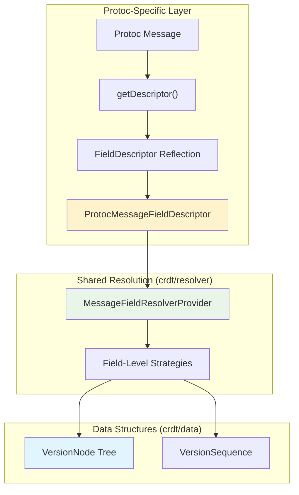

# CRDT Protoc Module

This module provides CRDT conflict resolution for standard Google Protocol Buffer (protoc-generated) messages, enabling distributed synchronization for Java/backend services using the same field-level versioning semantics as the Wire implementation.

## Overview

The Protoc module adapts shared CRDT resolution logic (see `crdt/resolver`) to work with protoc-generated Java/Kotlin classes. While the `crdt/wire` module uses Wire's annotation system for field introspection, this module uses protoc's descriptor-based reflection to achieve identical conflict resolution behavior.

**Key Difference from Wire Module:**
- **Wire:** Uses `@WireField` annotations and `ProtoAdapter` for compile-time field metadata
- **Protoc:** Uses `getDescriptor()` and `FieldDescriptor` for runtime field introspection
- **Shared:** Both delegate to `MessageFieldResolverProvider` from `crdt/resolver` for identical conflict resolution

**Why Two Implementations?**
- Wire provides superior Kotlin ergonomics for Android development
- Protoc is the standard for Java backend services and cross-platform compatibility
- Maintaining both avoids forcing a single protobuf library across diverse environments
- See `crdt/resolver/README.md` for detailed rationale

**For Conflict Resolution Concepts:** See `crdt/resolver/README.md` for comprehensive documentation on field-level LWW semantics, version tree structure, ResolutionStrategy taxonomy, and collection merging strategies.

## Architecture Overview

The Protoc module provides a descriptor-based adapter layer between protoc-generated messages and shared resolution logic:

### Key Architectural Difference: Runtime Reflection vs Annotations

Unlike Wire's compile-time annotations, Protoc uses runtime descriptor inspection:

**Trade-off:** Runtime reflection overhead for build-time simplicity and dynamic adaptability.

---

## Key Concepts

### 1. Descriptor-Based Field Resolution

The critical architectural insight is leveraging protoc's descriptor system for automatic field traversal without code generation:

**Design Pattern:**
- **Wire approach:** Annotation-driven field metadata extraction
- **Protoc approach:** Descriptor-driven runtime reflection

**Performance Consideration:** Reflection overhead mitigated through aggressive caching of field resolvers in `ProtocCrdtResolverProvider` to amortize reflection cost.

### 2. Shared Resolution Semantics

Both Wire and Protoc modules delegate to `MessageFieldResolverProvider` from `crdt/resolver` for consistent conflict resolution. The only difference is how field metadata is extracted:
- **Wire:** Uses `@WireField` annotations
- **Protoc:** Uses `FieldDescriptor` reflection

For details on the resolution algorithms themselves (LWW, field-level merging, collection strategies), see `crdt/resolver/README.md`.

### 3. Custom CRDT Options Support

Protoc supports custom protobuf field options for controlling merge behavior:

**Field-Level Options:**
- `crdt_replace_on_conflict` - Treat field as atomic unit (no deep merging for nested messages)
- `crdt_id_field` - Field number to use as identity key for list-to-map transformation

**Collection Options (maps and ID-based lists):**
- `crdt_max_tombstones` - Maximum number of deletion tombstones to retain (default: 1024)
- `crdt_tombstone_ttl` - Time-to-live for tombstones in milliseconds (default: null, no expiration)

These options enable configuration of tombstone cleanup policies to prevent unbounded growth of deletion markers. See `crdt/resolver/README.md` for detailed semantics of tombstone cleanup and collection strategies.

### 4. Key Implementation Classes

The module consists of five main classes working together:

**ProtocCrdtResolverProvider:**
- Factory with `ConcurrentHashMap` caching to avoid expensive reflection
- Thread-safe for concurrent access
- Handles recursive message references through lazy initialization

**ProtocMessageResolver:**
- Implements `CrdtResolver<Message, VersionNode, Version>`
- Delegates to `MessageLocalResolver` and `MessageIncomingResolver` from resolver module
- Manages field-level version tracking and OneOf field constraints

**ProtoMessageFieldDescriptor:**
- Extracts metadata from protobuf `FieldDescriptor`
- Reads custom CRDT options (`crdt_replace_on_conflict`, `crdt_id_field`)
- Classifies fields by type (primitive, message, map, repeated)
- Handles OneOf group membership

**ProtocVersionNodeAdapter:**
- Singleton adapter implementing `VersionNodeAdapter<VersionNode, Version>`
- Bridges protobuf `VersionNode` structures with resolver algorithms
- Creates version nodes for different collection types (Struct, Repeated, Maps)

**ProtoMessageBuilder:**
- Wraps `Message.Builder` to implement `MessageBuilder` interface
- Enables field-level updates during merge operations

### 5. Performance Considerations

**Reflection Overhead:** Runtime descriptor inspection via `getDescriptor()` has computational cost compared to Wire's compile-time annotations.

**Mitigation Strategy:** Aggressive caching of resolver instances (not just field resolvers) in `ProtocCrdtResolverProvider` amortizes reflection cost across operations.

---

## Integration Patterns

### Resolver Creation

The module provides `ProtocCrdtResolverProvider` as the entry point for creating message-specific resolvers:

1. **Create Provider** → Instantiate with version comparator (defaults to `InOrderVersionResolver`)
2. **Create Resolver** → Call `messageResolver(descriptor, builderFactory)` for each message type
3. **Resolver Caching** → Provider caches resolvers using `ConcurrentHashMap` to avoid expensive reflection
4. **Handle Recursion** → Lazy initialization handles recursive message references correctly

**Key Classes:**
- `ProtocCrdtResolverProvider`: Factory with caching for resolver instances
- `ProtocMessageResolver`: Implements both `MessageLocalResolver` and `MessageIncomingResolver` interfaces
- `ProtoMessageFieldDescriptor`: Extracts field metadata using protobuf descriptors
- `ProtocVersionNodeAdapter`: Adapts `VersionNode` protobuf structures to resolver framework
- `ProtoMessageBuilder`: Wraps protobuf builders for field-level updates

### Unified Resolution Architecture

Unlike the README's previous description, the Protoc module uses a **unified resolver** (`ProtocMessageResolver`) that implements both local and incoming resolution interfaces. The resolver automatically handles both scenarios within the same class, delegating to `MessageLocalResolver` and `MessageIncomingResolver` strategies from the resolver module.

### Java/Kotlin Integration

The resolvers work seamlessly with standard protobuf patterns:
- Uses `getDescriptor()` for runtime field introspection
- Builder pattern via `Message.Builder` for construction
- Standard serialization via `parseFrom()` and `toByteArray()`
- Supports both `GeneratedMessage` and `DynamicMessage` types

---

## Cross-Platform Consistency

The Protoc module ensures Java backend services apply identical conflict resolution logic as Android clients using Wire:

**Consistency Guarantee:** Both implementations delegate to the same `MessageFieldResolverProvider`, ensuring deterministic conflict resolution across all platforms.

---

## Related Modules

- **`crdt/resolver`**: Authoritative source for conflict resolution algorithms
- **`crdt/data`**: Defines version structures used by both Wire and Protoc
- **`crdt/protoc-data`**: Provides Java protobuf classes from shared proto schemas
- **`crdt/wire`**: Parallel implementation for Wire-generated Kotlin classes
- **`crdt/api`**: High-level DocumentStore abstraction both implementations support

