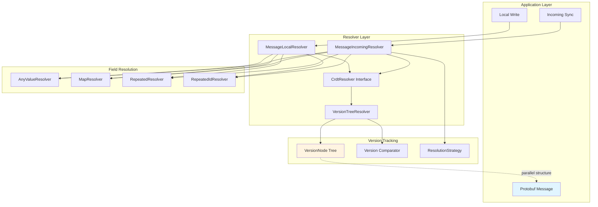
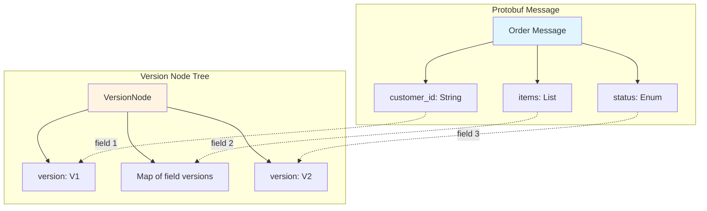
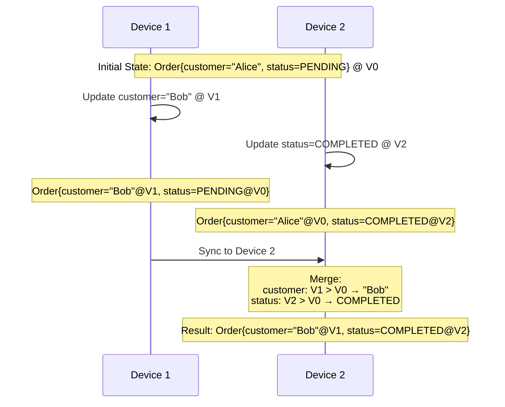
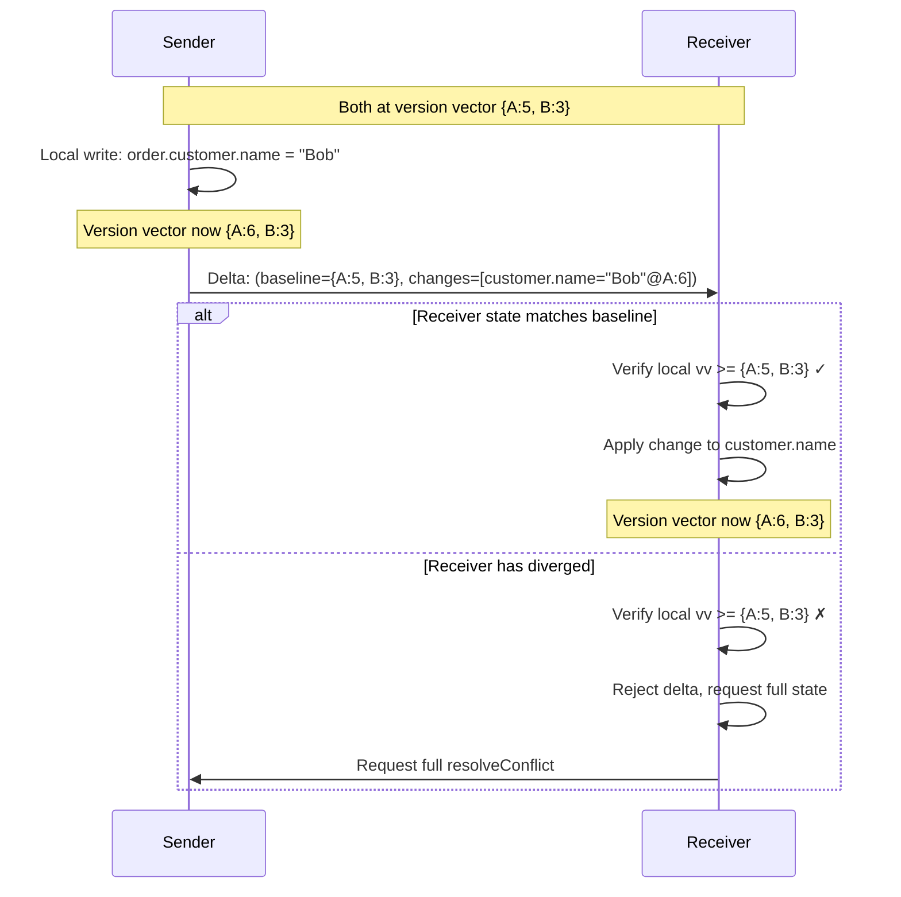
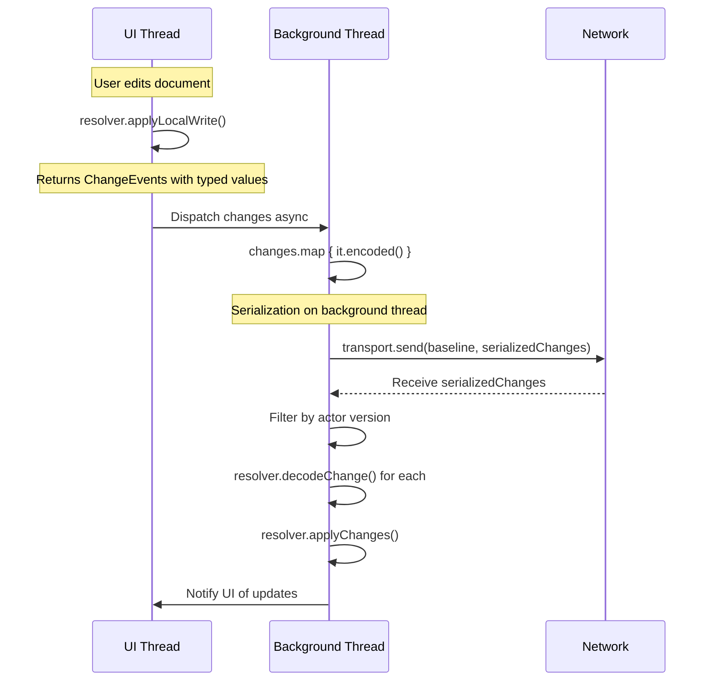

# CRDT Resolver

Field-level CRDT conflict resolution for Protocol Buffer messages enabling leaderless peer-to-peer synchronization across distributed devices without coordination overhead or data duplication.

## Historical Context

### The Distributed Synchronization Problem

Restaurant environments require 3-5 devices (POS terminals, tablets, kiosks) to maintain consistent order state despite:
- Network partitions between devices
- Arbitrary message delays and reordering
- Devices running different app versions
- Need for immediate local updates without coordination

### Traditional Approaches Rejected

**Dedicated On-Site Server**
- Additional hardware per location
- Single point of failure
- Depends on reliable local networking
- Installation and maintenance overhead

**Leader-Based Coordination (Raft, Paxos)**
- Problematic with small device counts (3-5 nodes)
- Failed leader elections with low node counts
- Split-brain scenarios during network partitions
- Orphaned devices unable to rejoin cluster
- Extended periods without consensus during failures

**Version Wrapped CRDTs (Automerge, Yjs, Ditto)**
- Maintain separate data representation from application types
- Require bidirectional mapping layers
- Redundant storage of same data
- Full traversal required for every operation
- Complex adapters and abstractions
- For a protobuf message with F fields at depth D: **O(F × D) memory overhead** and **O(F) computational complexity per read/write**

### Evolution to Current Solution

**Initial Implementation (RFC - CrdtDB & Local Sync Order Management)**
- Emulated Ditto's strategy of encapsulating field data and version data together
- A/B tested against Ditto behind an abstraction layer
- Both showed poor performance in production

**Current Solution**
- Operates directly on protobuf structures with parallel version tree
- **~90% reduction in DB operation latency** vs initial implementation and Ditto
- O(1) access to application data
- O(m) version tracking overhead where m = modified fields (not total field count)
- Zero data duplication or mapping layers

### Cross-Platform Strategy: Wire and Protoc Implementations

The resolver module provides platform-agnostic conflict resolution algorithms, with two implementations adapting these algorithms to different protobuf ecosystems:

**Wire Implementation (crdt/wire):**
- Targets Kotlin/Android development with superior ergonomics
- Uses `@WireField` annotations for compile-time metadata
- Zero reflection overhead for field introspection
- Optimal for mobile performance

**Protoc Implementation (crdt/protoc):**
- Targets Java backend services and cross-platform compatibility
- Uses `getDescriptor()` for runtime field introspection
- Standard protobuf library used by most Java services
- Enables backend integration without forcing Wire adoption

**Shared Resolution Logic:**
Both implementations delegate to `MessageFieldResolverProvider` in this module, ensuring identical conflict resolution semantics across all platforms. The only difference is how field metadata is extracted (annotations vs descriptors).

**Why Not a Single Implementation?**
- Wire's Kotlin focus makes it less ergonomic for pure Java environments
- Backend services already standardized on Google protobuf
- Forcing a single library would create adoption friction
- Maintaining both provides flexibility while sharing core algorithms

### Design Rationale

**Protocol Buffers as Data Layer**
- Forward/backward compatibility for version heterogeneity across devices
- Type safety prevents field type conflicts through explicit schema
- Cross-platform consistency (mobile clients + backend services)
- Efficient binary encoding minimizes bandwidth in poor network conditions

**Last Write Wins (LWW) Merge Strategy**
- Intuitive: Recent changes align with real-world expectations
- Recoverable: Undesirable resolutions correctable through business processes
- Explainable: Non-technical staff can understand conflict outcomes
- Sufficient: Most order management conflicts naturally resolved by recency

**Core Innovation**
Eliminate architectural bottleneck by operating directly on protobuf structures with parallel version tree, avoiding all mapping, duplication, and container overhead present in traditional CRDT libraries.

---

## Architecture Overview



### Component Responsibilities

**CrdtResolver Interface**
- Unified interface combining local writes and conflict resolution
- Generic over value type `T`, version node type `N`, and version type `V`
- Splits into `CrdtLocalResolver` and `CrdtIncomingResolver`

**MessageLocalResolver**
- Processes local writes field-by-field
- Updates versions only for changed fields (unchanged fields retain versions)
- Handles document creation, updates, and deletion (tombstones)
- Enforces OneOf field constraints (only one field per group has value)

**MessageIncomingResolver**
- Resolves conflicts between local and incoming state
- Merges both values and their version structures recursively
- Returns `ResolutionStrategy` indicating how conflict was resolved

**Field-Specific Resolvers**
- `AnyValueResolver`: Primitive scalar values (LWW by version comparison)
- `MapResolver<K,V>`: Per-key version tracking with recursive value resolution
- `RepeatedResolver`: Position-based list tracking
- `RepeatedIdResolver`: Identity-based list tracking (transforms list to map internally)

**VersionTreeResolver**
- Provides version node manipulation and comparison
- Maintains parallel tree structure mirroring protobuf field hierarchy
- Adapter pattern for version implementation flexibility

---

## Key Concepts

### 1. Parallel Version Tree Structure

The library maintains a **parallel tree** of version nodes matching the protobuf message structure without duplicating field values.



**Benefits:**
- **O(1) field access**: Read protobuf fields directly without traversal
- **O(m) space overhead**: Only modified fields have version nodes (m = modified field count)
- **No marshalling**: Zero serialization cost between CRDT layer and application
- **Type safety**: Compile-time checking through protobuf generated code

### 2. Field-Level Version Granularity

Each protobuf field tracks its own version independently, enabling surgical conflict resolution.



**Without field-level versions**, the entire message would be compared, causing one device's changes to completely overwrite the other's. Field-level tracking merges both updates correctly.

### 3. Version Semantics: minVersion and maxVersion

The resolver uses two key version concepts for tree construction and conflict resolution:

#### minVersion: The Sentinel for "Never Modified"

`minVersion` is a sentinel value representing "no version" or "never modified." It's guaranteed to be less than any real version created by the system.

**Use Cases:**

1. **Default for null nodes**: When a node has no explicit version (`versionValue == null`), `minVersion` is used for comparison:
   ```kotlin
   val localVersion = localNode?.versionValue ?: minVersion
   val incomingVersion = incomingNode.versionValue ?: minVersion
   ```

2. **Schema evolution**: New fields added to a message schema have no version until explicitly set. Using `minVersion` ensures any incoming version for that field will win.

3. **Initial document state**: Before any writes, all fields effectively have `minVersion`, so the first write to any field will establish its version.

#### maxVersion: Subtree Freshness for Message vs Null Resolution

`maxVersion` recursively finds the highest version anywhere in a node's subtree. This is critical when resolving a message field against null (deletion).

**The Rule:** When comparing a message against a deletion:
- Compute `maxVersion` of the message's entire subtree
- Compare against the deletion's version
- If `maxVersion > deletion version`: Message wins (some child is newer than deletion)
- If `deletion version > maxVersion`: Deletion wins (deletion is more recent than all children)

```
Example using Version{timestamp, actor_id, actor_version}:

// Different devices modified different fields at different times
customer {
    name: "Alice"   @ Version{t=1000, actor=100, v=1}
    email: "a@x.com" @ Version{t=1050, actor=200, v=1}  ← maxVersion (t=1050)
    phone: "555"    @ Version{t=1020, actor=300, v=1}
}
maxVersion = Version{t=1050, actor=200, v=1} (highest timestamp among all children)

Case 1: Incoming deletion @ Version{t=1060, actor=400, v=1}
  t=1060 > t=1050 → Deletion wins → customer = null

Case 2: Incoming deletion @ Version{t=1030, actor=400, v=1}
  t=1050 > t=1030 → Message wins → customer preserved with all fields
```

#### minVersion for Message Node Construction

When building a message's version node, the parent node's version is set to the `minVersion` across all child field versions. This represents "when this message structure was established":

```kotlin
// After processing all fields:
val parentVersion = fieldVersions.values.minVersion(currentVersion)

// Individual fields keep their specific versions in the fields map
// Parent version = oldest modification that defines current shape
```

This differs from `maxVersion` (used for conflict resolution) because:
- `minVersion` answers: "What's the oldest version defining this structure?"
- `maxVersion` answers: "What's the newest modification anywhere in this subtree?"

### 4. Resolution Strategy Taxonomy

The `ResolutionStrategy` enum captures how conflicts were resolved:
- **NO_CHANGE** - Values identical, no update needed
- **LOCAL** - Local version newer, kept current value
- **INCOMING** - Incoming version newer, adopted incoming value
- **MERGED_VALUES** - Set union, counter max, field-level merge, etc.

**Strategy Composition:**
Strategies compose to track mixed resolutions across nested structures:
- Identical strategies remain unchanged
- Different non-merged strategies become MERGED_VALUES
- MERGED_VALUES is absorbing (once merged, always merged)

This composition enables tracking whether a complex nested message resolution involved any actual merging or was purely one-sided.

### 5. Local Write vs Incoming Resolution

The module splits write operations into two distinct paths:

**Local Writes**
- Apply user-initiated changes with a new version
- Version provided by caller, applied to modified fields
- Returns boolean indicating whether value changed
- Optimized for quick acknowledgment of UI changes
- Simpler logic since no conflict resolution needed

**Incoming Resolution**
- Merge state from another device with full version history
- Both sides bring complete VersionNode structures
- Returns ResolutionStrategy indicating merge outcome
- Handles complex recursive merging of nested structures
- Must be deterministic and commutative across all devices

This separation enables different optimization paths, clearer semantic boundaries, and type-safe return values appropriate to each operation's purpose.

### 6. Delta Synchronization and Baseline Actors

The library supports two synchronization modes: **full-state resolution** and **delta-based sync**. Delta sync is more efficient but requires baseline matching to ensure correctness.

**Full-State Resolution (`resolveConflict`)**
- Both replicas exchange complete document state and version trees
- Handles arbitrary divergence—works regardless of message ordering or lost messages
- Higher bandwidth cost but guaranteed correctness
- Use when replicas may have diverged significantly

**Delta-Based Sync (`changeDelta` + `applyChanges`)**
- Sender computes minimal changes relative to receiver's known state
- Transmits only the delta plus the baseline version vector
- Much lower bandwidth for incremental updates
- **Requires baseline matching** for correctness

#### Why Baseline Matching is Required for Delta Sync

Delta changes contain only leaf field values with their paths—they don't include full parent message context. The `applyChanges` method requires `incomingBaselineActors` to verify that the local state matches the baseline from which changes were computed. When baseline validation fails, `applyChanges` returns `null` to signal that the caller should fall back to full-state `resolveConflict`.



**The maxVersion Problem with Nested Fields:**

When resolving a message field against null, the resolver compares the `maxVersion` of the entire message subtree against the null's version. If the message's maxVersion is greater, the entire message (with all its children) wins. If the null's version is greater, the deletion wins.

With delta sync, we might receive a change for a single child field that has a version newer than the null—but we're missing all the sibling data needed to reconstruct the complete message.

**Example using Version{timestamp, actor_id, actor_version}:**

Versions are compared lexicographically: first by `timestamp`, then by `actor_id` for tie-breaking. Different devices (actors) can modify different fields concurrently:

```
// Device A (actor_id=100) created the customer at t=1000
// Device B (actor_id=200) updated email at t=1010
// Device C (actor_id=300) updated phone at t=1005

Baseline state: order {
  customer {
    name: "Alice"   @ Version{t=1000, actor=100, v=1}
    email: "a@x.com" @ Version{t=1010, actor=200, v=1}  ← maxVersion (highest timestamp)
    phone: "555"    @ Version{t=1005, actor=300, v=1}
  }
}

// Device D (actor_id=400) deletes customer at t=1008
Local state: order { customer: null @ Version{t=1008, actor=400, v=1} }

// Device B (actor_id=200) updates name at t=1020 (doesn't know about deletion)
Incoming delta: path=[customer, name], value="Bob" @ Version{t=1020, actor=200, v=2}
```

**In a full resolution:** The incoming message's maxVersion would be t=1020 (from the name field), which beats the null's t=1008. The message wins and we correctly preserve all children:
```
customer {
  name: "Bob"       @ Version{t=1020, actor=200, v=2}
  email: "a@x.com"  @ Version{t=1010, actor=200, v=1}
  phone: "555"      @ Version{t=1005, actor=300, v=1}
}
```

**With only the delta:** We only have the `name` field. If we apply it, we'd incorrectly create:
```
customer { name: "Bob" }  // email and phone are lost!
```

The delta doesn't tell us:
- That sibling fields `email` and `phone` exist and should be preserved
- What their values and versions are (from Device B and C)
- Whether the incoming message as a whole should win against the null

**With baseline validation:**
- `incomingBaselineActors` reveals the sender's knowledge at change time
- If baseline doesn't include our deletion (local has diverged), we detect the mismatch
- We reject the delta and fall back to `resolveConflict`
- Full resolution has both complete states with all child data to merge correctly

**Divergence Consequences:**
- **Lost updates**: Local changes after baseline get silently overwritten
- **Orphaned nested changes**: Changes to children of deleted parents can't apply
- **Duplicate application**: Already-incorporated changes reapplied incorrectly
- **Inconsistent state**: Merge assumes a starting point that doesn't exist

**When to Use Each Mode:**

| Scenario | Recommended Mode |
|----------|------------------|
| Initial sync / reconnection after partition | Full-state (`resolveConflict`) |
| Real-time incremental updates | Delta (`applyChanges`) with fallback |
| Unknown divergence possible | Full-state (`resolveConflict`) |
| Guaranteed in-order delivery | Delta (`applyChanges`) |

### 7. Map and Collection Strategies

**Map Resolver** (per-key version tracking)
- Maps track versions at both map level and per-key level
- Map-level version: Creation/deletion timestamp of entire map
- Key-level versions: Individual entry updates tracked independently
- Merge: Union of keys, per-key LWW conflict resolution
- Tombstones: Keys with null values preserve deletion events
- Type-safe key resolvers for Boolean, Int, Long, and String map keys

**Tombstone Cleanup** (configurable retention policies)
- **Purpose:** Prevent unbounded growth of deletion markers in maps and ID-based lists
- **TTL-based cleanup:** Remove tombstones outside the time window `[max_version - ttl, max_version]`
- **Count-based cleanup:** When exceeding `maxTombstones`, remove oldest tombstones (FIFO)
- **Live data versioning:** Update versions of live data to stay within TTL window, preventing incorrect deletion
- **Configuration options:**
  - `crdt_max_tombstones` - Maximum number of tombstones to retain (default: 1024)
  - `crdt_tombstone_ttl` - Time-to-live in milliseconds (default: null, no TTL)
- **Cleanup triggers:** Performed during local writes when creating new tombstones
- **Guarantees:** Cleanup maintains CRDT convergence properties by preserving recent deletion history

**RepeatedIdResolver** (identity-based lists)
- Transforms lists to maps internally using caller-provided key extraction function
- Delegates to MapResolver for CRDT semantics (per-item versioning)
- Converts back to list for application consumption
- Preserves item order by maintaining insertion sequence
- Enables element-level conflict resolution within lists
- Suitable for lists of entities with stable identities (e.g., order items with IDs)

**RepeatedResolver** (position-based lists)
- Simplest strategy for lists without stable identities
- Last write wins for entire list (treats list as atomic value)
- No element-level version tracking
- Suitable for small, frequently rewritten collections where element identity doesn't matter

### 8. Network Transmission: Encoding, Decoding, and Async Dispatch

The library provides a `ChangeEvent` abstraction optimized for efficient network transmission with lazy encoding and actor-based filtering.

#### Lazy Encoding Pattern

When local operations produce changes, they return `ChangeEvent` objects with:
- **Typed `value`**: The actual field value for inspection/logging
- **`encoded()` function**: Lazily serializes the value to bytes

```kotlin
// Local write returns typed ChangeEvents
val result = resolver.applyLocalWrite(current, node, actors, newValue, timestamp)

// Encoding is deferred - value is still typed here
result.changes.forEach { change ->
    println("Changed field: ${change.pathComponents}, value: ${change.value}")
}

// Serialize on background thread when dispatching to transport
backgroundScope.launch {
    val serializedChanges = result.changes.map { change ->
        SerializedChange(
            path = change.pathComponents.map { it.encode() },
            data = change.encoded(),  // Serialization happens here
            version = change.versionNode.encode()
        )
    }
    transport.send(baselineActors = actors.versionVector, changes = serializedChanges)
}
```

This pattern enables:
- **Non-blocking UI**: Serialization happens off the main thread
- **Inspection before send**: Log or filter changes while still typed
- **Conditional serialization**: Skip encoding if change will be filtered out

#### Decoding with Path-Based Adapter Selection

On the receiving side, `decodeChange()` navigates the path components to find the correct field-specific decoder:

```kotlin
// Receiver gets serialized changes from transport
val serializedChanges: List<SerializedChange> = transport.receive()

// Decode each change - the resolver navigates the path to find the right decoder
val changes = serializedChanges.map { serialized ->
    resolver.decodeChange(
        encodedValue = serialized.data,
        pathComponents = serialized.path.map { PathComponent.decode(it) },
        versionNode = VersionNode.decode(serialized.version)
    )
}

// Apply the decoded changes - returns null if baseline doesn't match
val result = resolver.applyChanges(localValue, localNode, localActors, changes, incomingBaseline)
if (result == null) {
    // Baseline mismatch - fall back to full-state resolution
    requestFullStateFromSender()
}
```

The decoder hierarchy handles different field types:
- **MessageChangeDecoder**: Navigates by field number to child decoders
- **MapChangeDecoder**: Navigates by map key to value decoder
- **RepeatedChangeDecoder**: Navigates by list index
- **SingleValueChangeDecoder**: Decodes leaf primitive values

#### Actor-Based Pre-Filtering

Before decoding, receivers can use version information to skip unnecessary work:

```kotlin
val serializedChanges = transport.receive()

// Filter by actor version BEFORE decoding
val newChanges = serializedChanges.filter { serialized ->
    val version = VersionNode.decode(serialized.version)
    val actorId = version.actorId
    val actorVersion = version.actorVersion

    // Only decode if we don't already have this version
    (localActors.versionVector[actorId] ?: 0L) < actorVersion
}

// Now decode only the changes we actually need
val changes = newChanges.map { serialized ->
    resolver.decodeChange(serialized.data, serialized.path, serialized.version)
}
```

This is particularly valuable when:
- Receiving batched updates that may include already-seen changes
- Network retries that resend previously received changes
- Broadcast scenarios where not all changes are relevant

#### Complete Async Flow



---

## Integration Architecture

### Resolver Creation Pipeline

The module follows a layered initialization pattern:

1. **Version Type Definition** - Define version representation (e.g., timestamp + device ID hybrid logical clocks)
2. **Version Comparator** - Implement comparison logic with tie-breaking for deterministic ordering
3. **Version Node Structure** - Define tree structure holding versions and field-level children
4. **Version Node Adapter** - Bridge between version node implementation and resolver algorithms
5. **Version Tree Resolver** - Combines comparator and adapter, provides tree manipulation utilities
6. **Message-Specific Resolver** - Binds protobuf message types with field descriptors

Each layer is generic and reusable, allowing different version implementations (vector clocks, Lamport timestamps, hybrid logical clocks) without changing resolution logic.

### Local Write Processing

When applying local writes, the resolver:
- Compares current and new values field-by-field
- Updates version nodes only for changed fields (unchanged fields retain existing versions)
- Returns a boolean indicating whether any change occurred
- Handles document creation (new version node), updates (field-level version updates), and deletion (tombstone with version)

The version provided by the caller is applied to modified fields, establishing causality for future conflict resolution.

### Incoming Conflict Resolution

When merging incoming state from another device, the resolver:
- Recursively compares local and incoming version nodes
- Applies field-level last-write-wins based on version comparison
- Merges collection keys (maps) or entire collections (lists) based on strategy
- Returns a `ResolutionStrategy` enum indicating the merge outcome (NO_CHANGE, LOCAL, INCOMING, or MERGED_VALUES)

Both sides provide complete version node trees, enabling deep recursive merge of nested messages and collections.

### Field Descriptor System

The `MessageFieldDescriptor` interface provides runtime introspection of protobuf fields:
- Field number (tag) for version node storage
- Value type classification (required, optional, or nested message)
- Collection type (map, repeated, or scalar)
- Map key type for type-safe resolver selection
- OneOf group membership for mutual exclusion enforcement
- Field accessors bridging generated protobuf code to generic resolvers

The `MessageFieldResolverProvider` factory creates appropriate field-specific resolvers based on descriptor metadata, selecting from scalar, map, list, or nested message strategies.

---

## Performance Characteristics

### Complexity Analysis

| Operation | Time | Space |
|-----------|------|-------|
| Field read | O(1) | - |
| Field write | O(1) | O(1) per modified field |
| Message merge | O(m) | O(m) where m = modified fields |
| Map merge | O(k) | O(k) where k = distinct keys |
| List merge (ID-based) | O(n) | O(n) where n = list size |

### Memory Overhead

**Traditional CRDT libraries:**
- O(F × D) for F fields at depth D
- Duplicate storage of values in CRDT representation
- Marshalling cost on every access

**This library:**
- O(m) where m = modified field count
- Zero value duplication (version tree is parallel structure)
- Zero marshalling (direct protobuf access)

### Production Metrics

- **~90% reduction** in database operation latency vs Ditto and initial implementation
- Tested on low-end Android devices (min SDK 24)
- Optimized for large document sizes typical in order management
- Handles network partitions and message reordering in production restaurant environments

---

## Related Work

| Solution | Approach | Limitations for Our Use Case |
|----------|----------|------------------------------|
| **Ditto** | Commercial distributed database with CRDT support | Proprietary, licensing costs, custom storage layer, performance issues on low-end devices, extremely large native binary |
| **Automerge** | Rust CRDT library with rich data types | Maintains separate document representation requiring mapping, no protobuf integration |
| **Yjs** | JavaScript CRDT for collaborative editing | Custom data structures, requires JavaScript runtime |
| **CouchDB/PouchDB** | Document databases with replication | Document-level granularity (not field-level), requires custom conflict handlers |
| **Operational Transformation** | Alternative to CRDTs | Requires central server for operation ordering, not suitable for peer-to-peer |

**Common problems overcome:**
- No schema enforcement
- No compile-time type checking
- No forward/backward compatibility guarantees
- Overhead of parsing JSON or custom data models on every access
- Data duplication between CRDT layer and application types

---

## Module Dependencies

This module has **zero external dependencies** beyond Kotlin standard library, enabling:
- Use in any Kotlin/JVM project
- Minimal binary size impact
- No transitive dependency conflicts
- Fast compilation times

Test dependencies only:
- JUnit Jupiter for testing
- Kotlin Test
- MockK for mocking

