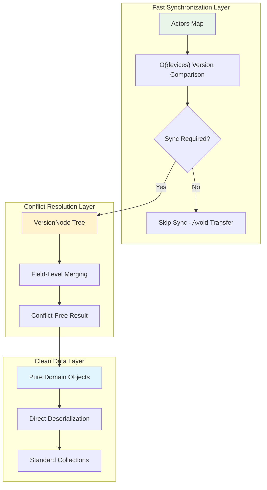
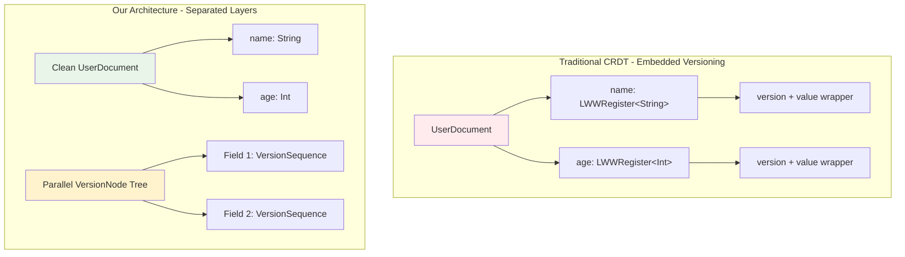
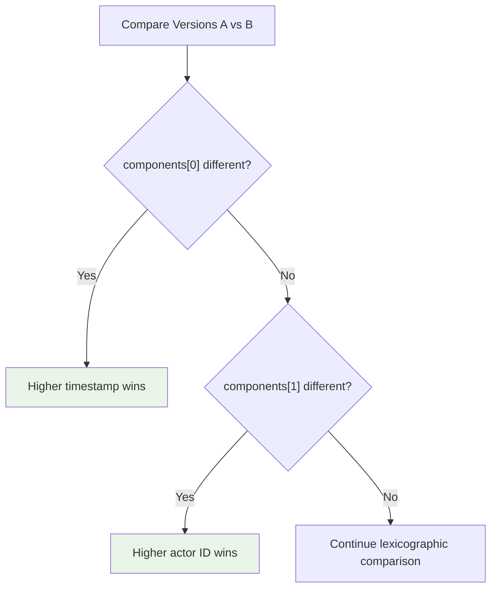
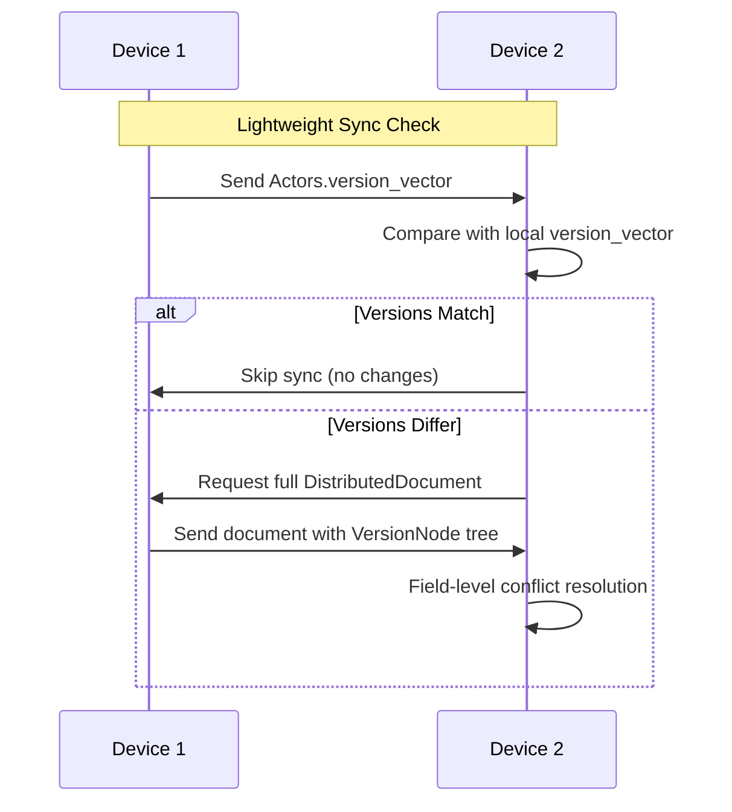

# CRDT Data Module

This module provides core data structures for CRDT version management using a separated architecture that stores version information independently from document data, enabling efficient conflict resolution while maintaining clean business objects.

## Historical Context

### The Separated Architecture Solution

**Problem:** Traditional CRDT implementations embed version metadata directly within business data, creating architectural coupling, read path overhead, and transformation complexity on resource-constrained mobile devices.

**Alternatives Considered:**

1. **Keypath-Style Storage** (rejected):
   - Store individual field versions as key-value pairs with paths from document root
   - *Rejected because:* Storage overhead from hundreds of key entries per document, complex keypath parsing (O(depth) operations), expensive object reconstruction, network inefficiency

2. **Embedded Versioning in Domain Objects** (rejected):
   - Wrap every field with CRDT containers (e.g., `LWWRegister<String>` instead of `String`)
   - *Rejected because:* Memory overhead for wrapper objects, read path complexity requiring unwrapping, business logic pollution, additional serialization layers

3. **Operation-Based CRDTs** (rejected):
   - Store and replay operation logs for conflict resolution
   - *Rejected because:* Storage explosion from operation logs, complex garbage collection requirements

**Architectural Trade-offs Made:**
- **Separation vs Simplicity:** Accepted dual-tree complexity (data + versions) for clean architectural separation
- **Cross-Platform Consistency:** Unified protobuf schema over platform-specific optimizations
- **Read Optimization:** Prioritized clean read paths over simplified write operations
- **Future Extensibility:** Designed for differential synchronization (transmit only changed version nodes)

**Conflict Resolution Strategy:** Last-Write-Wins (LWW) using network-synchronized timestamps combined with random actor identifiers, ensuring total ordering without clock synchronization requirements across mobile devices.

## Architecture Overview

The module implements a three-layer architecture separating versioning concerns from business data:

**Key Innovation:** Complete separation between version management and business data eliminates coupling issues of traditional embedded approaches.

---

## Key Concepts

### 1. Separated Version Architecture

The critical architectural insight is complete separation between version management and business data:

**Concrete Benefits:**
- **Clean Business Objects:** Standard Kotlin/Java types without wrapper pollution
- **Lazy Version Loading:** Version trees only constructed during conflict resolution
- **Protobuf Efficiency:** Direct deserialization using standard protobuf parsing
- **Memory Locality:** Separate storage improves cache efficiency

**Complexity Analysis:** Requires maintaining two parallel tree structures (data tree + version tree), doubling conceptual complexity but eliminating runtime coupling.

### 2. LWW Semantics with VersionSequence

The module uses generalized `VersionSequence` (repeated int64 components) to implement Last-Write-Wins conflict resolution:

**Network Clock + Actor Strategy:**
- **Component 0:** Network-synchronized timestamp (primary ordering)
- **Component 1:** Random actor identifier (deterministic tie-breaking)
- **Comparison:** Lexicographic comparison provides deterministic LWW semantics

**Mobile Clock Solution:** Using network time as primary component avoids local device clock synchronization problems while maintaining intuitive temporal ordering.

### 3. Unified Protobuf Schema for Cross-Platform Efficiency

Single protobuf schema serves both client and server with context-dependent semantics:

**Schema Components:**
- `DistributedDocument.version_vector` (Actors map): Fast O(devices) sync decision
- `DistributedDocument.version_node`: Detailed field-level version tree
- `DistributedDocument.data`: Clean business data as bytes

**Benefits:**
- No transformation overhead across client/server boundaries
- Type safety with compile-time guarantees
- Network-efficient binary encoding
- Identical conflict resolution logic everywhere

### 4. Memory Efficiency Through Version Inheritance

Critical optimization: `Struct.fields` map only contains entries differing from base version, not every field.

**Pattern:** Fields without explicit entries inherit the base version from parent `VersionNode.version`, providing massive memory savings for typical CRDT usage where documents are created with many fields at once but only few fields update over time.

> **Merge-time exception:** during an incoming merge, a never-written field (no explicit node *and* an empty/default value) is pinned to `minVersion` rather than inheriting the parent, so it cannot overwrite a populated value on another replica. See `resolver/README.md` → "Never-Set vs Reset vs Inherited".

**Complexity:** O(m) space overhead where m = modified field count (not total field count F)

### 5. Fast Sync with Actors Version Vector

The `Actors` message (map of actor ID → version) enables O(devices) synchronization decisions without processing full documents:

**Network Efficiency:** Avoid transferring full document when no sync needed.

---

## Integration Patterns

### Three-Phase Document Lifecycle

**Phase 1 - Fast Sync Decision:**
Compare `Actors.version_vector` maps (O(devices) comparison)

**Phase 2 - Conflict Resolution (if needed):**
Process `VersionNode` tree for field-level merging (O(modified fields))

**Phase 3 - Data Access:**
Deserialize clean business objects from `wire-data` bytes (zero version overhead)

### Future Differential Synchronization

Planned enhancement: Send only changed version nodes with field paths instead of full documents.

**Network Payload Reduction:** From ~1.5KB full document to ~0.1KB diff for typical single-field updates.

---

## Performance Characteristics

### Complexity Comparison

| Aspect | Traditional Embedded | Separated Architecture |
|--------|---------------------|----------------------|
| **Memory** | O(F) wrapper objects per field | O(m) where m = modified fields |
| **Field Access** | O(1) unwrap + access | O(1) direct protobuf access |
| **Document Load** | Parse wrappers + values | Parse data only (lazy versions) |
| **Sync Decision** | O(D) document comparison | O(N) actors where N = devices |

### Architectural Basis

**Memory Efficiency:** Only modified fields have version nodes; clean objects use standard types
**Network Efficiency:** Fast sync comparison avoids full document transfer when unchanged
**Processing Efficiency:** Lazy version loading (only during conflict resolution)

---

## Protobuf Schema Evolution

The module uses proto3 with careful evolution strategy:
- Always add new fields as optional
- Reserve deleted field numbers to prevent reuse
- Maintain backward/forward compatibility for version heterogeneity across devices

See `crdt/resolver/README.md` for how these structures are used in conflict resolution algorithms.

---

## Related Modules

- **`crdt/resolver`**: Uses these structures for field-level conflict resolution
- **`crdt/wire`**: Wire-generated Kotlin classes for Android/Kotlin
- **`crdt/protoc-data`**: Protoc-generated Java classes for backend services
- **`crdt/api`**: High-level DocumentStore abstraction over version management
- **`crdt/core`**: Production system integrating version management with storage

