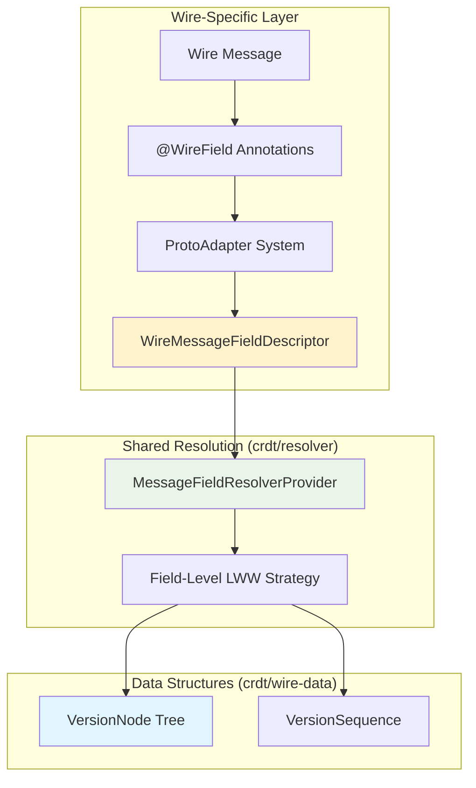
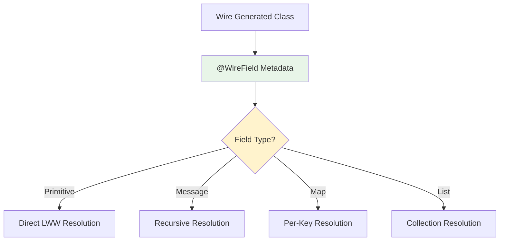

# CRDT Wire Module

This module provides CRDT conflict resolution for [Square's Wire](https://github.com/square/wire) protobuf library, enabling distributed synchronization for Wire-generated Kotlin messages using field-level versioning without modifying domain objects.

## Historical Context

### Wire's Annotation System Enables Generalized Resolution

Originally, protoc protolite-generated models were used for CRDT operations, but protolite lacked sufficient runtime metadata for generalized merging logic. Wire's annotation system (`@WireField`) and runtime adapters (`ProtoAdapter`) enabled automatic field traversal, eliminating hand-written merge logic per message type.

**Alternatives Considered:**

1. **Manual Merge Logic Per Message** (rejected):
   - Required hand-coding conflict resolution for each protobuf message
   - Error-prone and unmaintainable as schemas evolved
   - No consistency guarantees across different message types

2. **Third-Party CRDT Libraries (Ditto, Automerge)** (rejected):
   - JSON serialization overhead for performance-sensitive mobile apps
   - External dependency management complexity
   - Loss of type safety from protobuf schemas
   - See `crdt/resolver/README.md` for detailed analysis

**Architectural Decision:** Wire's rich metadata enabled a single generalized resolver implementation that works across all Wire message types, providing type-safe conflict resolution without per-message customization.

### Performance-Driven Dual Resolver Architecture

The module provides separate local and incoming resolvers optimized for different write patterns:
- **Local Resolver:** Optimized for user-initiated changes (assumes newer versions)
- **Incoming Resolver:** Full version comparison for network-received updates

**Trade-off:** Code duplication for significant performance gains in the critical path of user interactions.

## Architecture Overview

The Wire module bridges Wire's annotation system with shared CRDT resolution logic:

**Key Architectural Advantage:** Wire's compile-time annotations provide zero-reflection field metadata, enabling high-performance field traversal compared to Protoc's runtime descriptor approach.

---

## Key Concepts

### 1. Annotation-Driven Field Introspection

Wire's `@WireField` annotations encode field numbers, types, and collection semantics at compile time, enabling the resolver to automatically traverse any Wire message without reflection:

**Performance Benefit:** Compile-time metadata eliminates runtime reflection overhead present in Protoc-based approaches.

### 2. OneOf Field Group Invariant Enforcement

Wire's OneOf fields require special handling to maintain the protobuf invariant that only one field in a group can have a value. The resolver automatically clears version entries for other fields when any field in a OneOf group is set.

**Critical Implementation:** Setting any OneOf field automatically tombstones other fields in the same group at the version tree level, maintaining protobuf semantics during CRDT operations.

### 3. Configurable Collection Resolution Strategies

The `WireAdapterProvider` supports two distinct list merging strategies through configuration:

**Identity-Based Lists** (via `listIdAdapterFieldOverrides`):
- Transforms lists to maps internally using specified ID field
- Enables element-level conflict resolution
- Preserves order through insertion sequence
- Suitable for entities with stable identities (e.g., order items with IDs)

**Size-Based Lists** (default):
- Last-write-wins for entire list
- No element-level version tracking
- Suitable for small, frequently rewritten collections

**Tombstone Cleanup Configuration:**
Map and identity-based list fields support configurable tombstone retention policies via protobuf field options:
- `crdt_max_tombstones` - Maximum deletion tombstones to retain (default: 1024, FIFO eviction)
- `crdt_tombstone_ttl` - Time-to-live for tombstones in milliseconds (default: null, no expiration)

These options prevent unbounded growth of deletion markers while maintaining CRDT convergence properties. Cleanup occurs automatically during local write operations.

For detailed resolution semantics, see `crdt/resolver/README.md`.

### 4. ByteString Special Handling

Binary data fields (`ByteString`) can be configured for atomic replacement through `byteStringAdapterFieldOverrides`, treating large blobs as indivisible units rather than attempting byte-level merging.

---

## Integration Architecture

### Resolver Creation Pipeline

The Wire module follows a layered initialization pattern:

1. **Version Type Definition** → Define version representation (timestamp + actor ID)
2. **Version Comparator** → Implement LWW comparison with deterministic tie-breaking
3. **Version Node Adapter** → Bridge between version structures and resolver algorithms
4. **Version Tree Resolver** → Provide tree manipulation and version comparison utilities
5. **Wire Adapter Provider** → Configure collection strategies and special field handling
6. **Message-Specific Resolver** → Bind Wire message types with field descriptors

Each layer is generic and reusable across all Wire message types.

### Dual Resolver Strategy

Different data sources use optimized resolver paths:

**Local Writes:**
- Assumes user changes have later versions than existing data
- Optimized for quick acknowledgment of UI interactions
- Returns boolean indicating whether value changed

**Incoming Resolution:**
- Performs full version comparison for network-received updates
- Returns `ResolutionStrategy` indicating merge outcome
- Handles complex recursive merging of nested structures

### Runtime Adapter Creation

The `WireAdapterProvider` uses Wire's runtime reflection to create CRDT adapters for any Wire message type, with specialized behavior configurable through field overrides for list ordering and binary blob handling.

---

## Wire-Specific Challenges

### Challenge 1: Preserving Kotlin Null Safety

Wire's Kotlin code generation uses nullable types for optional fields, requiring careful handling to distinguish between unset fields and explicitly null values during conflict resolution.

**Resolution:** Version nodes track field presence independently from field values, maintaining protobuf optional field semantics.

### Challenge 2: Sealed OneOf Types

Wire generates sealed classes for OneOf fields in Kotlin, requiring specialized adapter logic to map between sealed class instances and version tree field numbers.

**Resolution:** Custom OneOf field descriptors bridge between Wire's sealed class representation and protobuf field numbering for version tracking.

---

## Performance Characteristics

### Complexity Analysis

| Operation | Time Complexity | Explanation |
|-----------|----------------|-------------|
| Field Read | O(1) | Direct protobuf field access, no traversal |
| Field Write | O(1) | Single field version update |
| Message Merge | O(m) | m = number of modified fields |
| Map Merge | O(k) | k = distinct keys across both versions |
| List Merge (ID-based) | O(n) | n = list size for identity lookup |

### Memory Overhead

**Traditional CRDT Libraries:** O(F × D) wrapper overhead for F fields at depth D
**Wire Module:** O(m) version nodes where m = modified field count (not total fields)

**Architectural Basis:** Parallel version tree structure (see `crdt/wire-data/README.md`) eliminates value duplication and marshalling costs.

---

## Future Evolution

### Cross-Platform Generalization

The module is evolving toward platform-agnostic CRDT logic shared between Wire (Kotlin/Android) and Protoc (Java/backend) implementations, with platform-specific adapters for field introspection.

**Design Goal:** Extract core merging logic into shared dependency that works across both annotation-based (Wire) and descriptor-based (Protoc) field introspection approaches.

### Differential Sync Capability

Future enhancement will support record diffs instead of full-message synchronization, traversing version nodes to exact change locations and applying targeted field updates while maintaining CRDT invariants.

---

## Related Modules

- **`crdt/resolver`**: Authoritative source for field-level resolution algorithms and strategies
- **`crdt/wire-data`**: Defines VersionNode, VersionSequence, and DistributedDocument schemas
- **`crdt/protoc`**: Parallel implementation for standard protoc-generated messages
- **`crdt/api`**: High-level DocumentStore abstraction both implementations conform to
- **`crdt/core`**: Complete production system integrating all CRDT components

